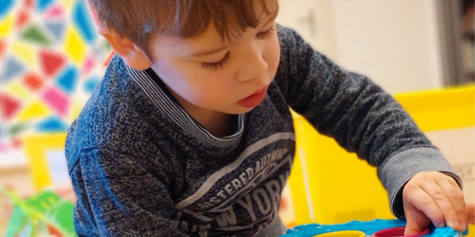

# Tots Playgoup Bern

> We are a friendly and open English speaking playgroup. It's a great place for children from 0-4yrs and their parents/caregivers to meet together, socialise, play and sing.

We meet **Wednesday mornings from 9:15am to 11:15am** in the lower hall at St Ursula's - Jubiläumsplatz 2, 3005 Bern (map further down). The cost is CHF 5 which includes a snack for the children and hot drinks and biscuits for the parents. 

You can just drop by unanounced we look forward meeting you! The group is run by parent on a voluntary basis - we all help each other out. Please be aware that during your visit you are solely responsilbe for your own child and that any use of our toys and infrastructure happens at your own risk.

Join us on [Facebook](https://www.facebook.com/groups/678038115547386/) and [Instagramm](https://www.instagram.com/parentstots/) for the latest tattle and connect to our lively group of english speaking parents from and around Bern.

Where we meet:
<iframe src="https://www.google.com/maps/embed?pb=!1m18!1m12!1m3!1d7644.014370363752!2d7.447606218355236!3d46.94269874129891!2m3!1f0!2f0!3f0!3m2!1i1024!2i768!4f13.1!3m3!1m2!1s0x478e39d1b4356da3%3A0x4117d3e1bad71df8!2sJubil%C3%A4umspl.%202%2C%203005%20Bern!5e0!3m2!1sen!2sch!4v1642362229597!5m2!1sen!2sch" width="600" height="300" style="border:0;" allowfullscreen="" loading="lazy"></iframe>

